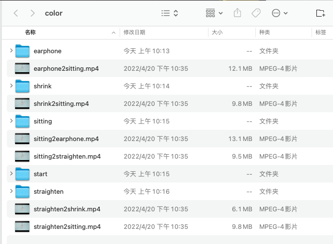
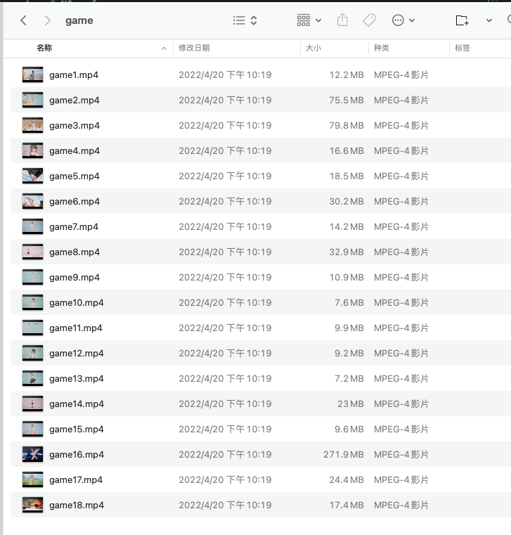

# N0va(鹿鸣)_for_mac

## 简介

这是个 N0va(鹿鸣) 的 mac 版（非官方制作）。

## 简易教程
1. 从 release 中下载 N0va_for_mac.dmg
2. 安装N0va_for_mac即可。

## 进阶教程
您需要先知道color 文件夹和 game 文件夹的作用

1. color 文件夹：存放鹿鸣本人的视频文件。为主播放文件。鹿鸣将根据不同状态从这里选择不同的视频作为壁纸。

> 1. xx2xx.mp4为换动作视频，程序仅能加载这六种换动作视频。
> 2. earphone 等文件夹为 earphone 状态下的视频。程序在 earphone状态下将随机加载其中的视频。您可将您的视频放入其中，程序也将加载。

 

2. game 文件夹：存放其他视频文件。每次切换视频时，程序以1%的概率播放其中的视频

 

如果您有视频也想加入播放队列，直接放入 game 目录下即可（仅支持 .mp4文件）。game 目录可为空。

## 引用

[提取视频请看这里](https://github.com/youfantan/N0vaResourceExtractor) 

[mac动态壁纸软件](https://github.com/zx1262111739/DynamicWallpaper) 

所以视频文件均来自鹿鸣（米哈游出品）,模型为米哈游版权所有。
